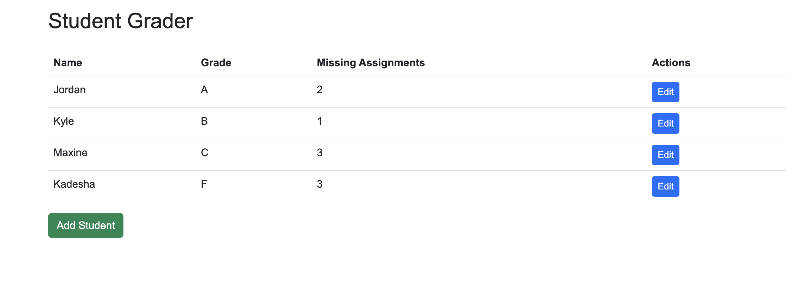

# Student Grader



## Table of Contents
- [Introduction](#introduction)
- [Features](#features)
- [Usage](#usage)
- [Project Structure](#project-structure)
- [Contributing](#contributing)
- [License](#license)

## Introduction
Student Grader is a simple web application designed to help educators manage and track student grades and missing assignments. It provides a user-friendly interface to view, edit, and add student information in real-time.

## Features
- Display student names, grades, and missing assignments in a table format.
- Edit student information (name, grade, and missing assignments) directly from the web interface.
- Add new students along with their grade and missing assignments.

## Usage
1. Clone the repository to your local machine.
   ```bash
   git clone https://github.com/hechadielhassania/student-grader.git
